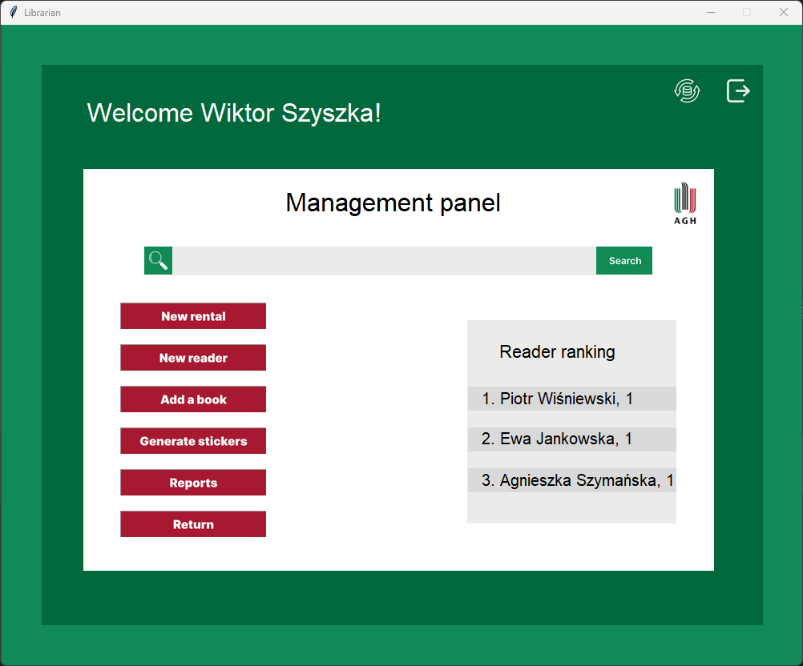
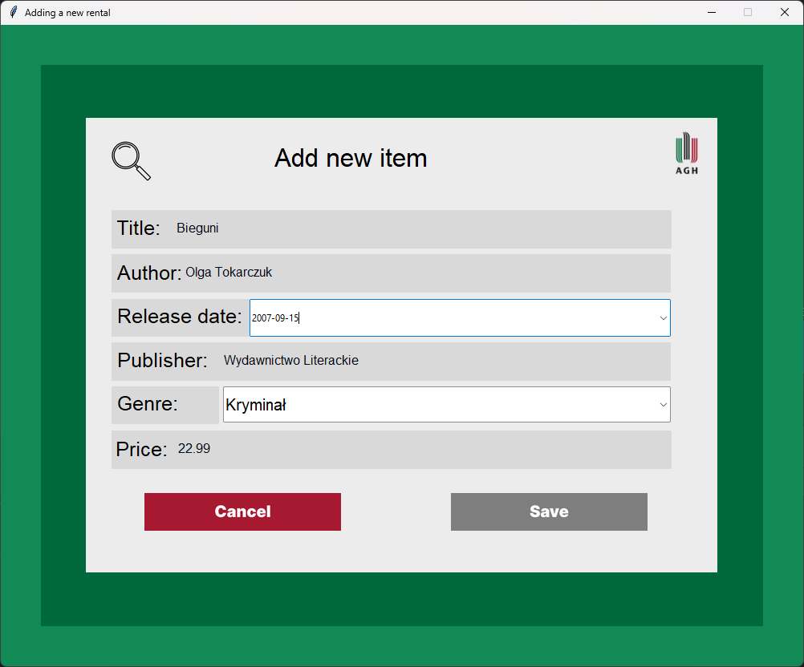
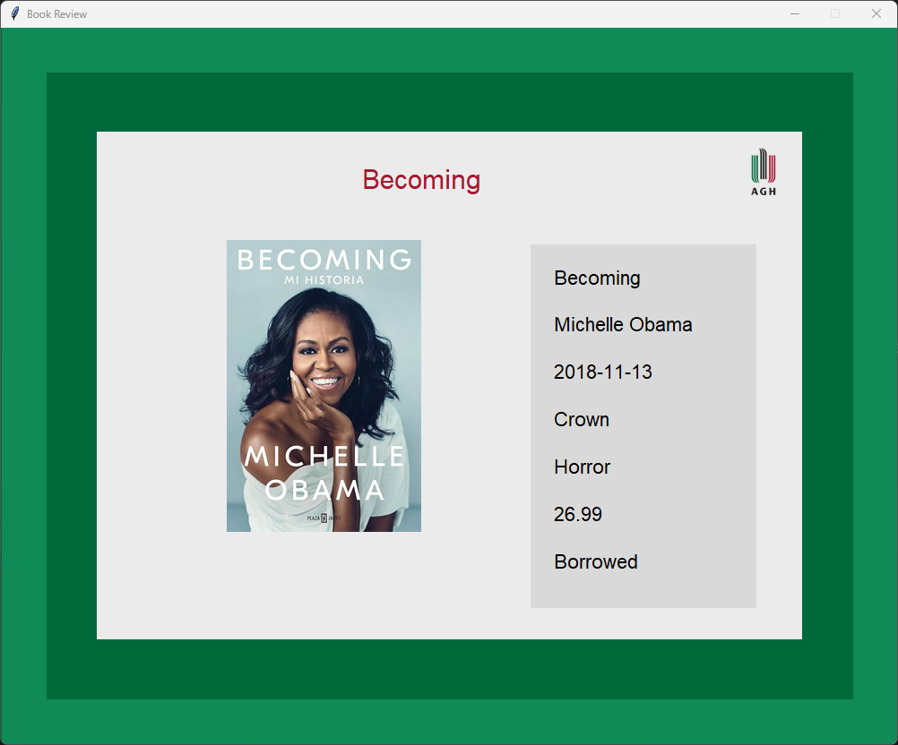
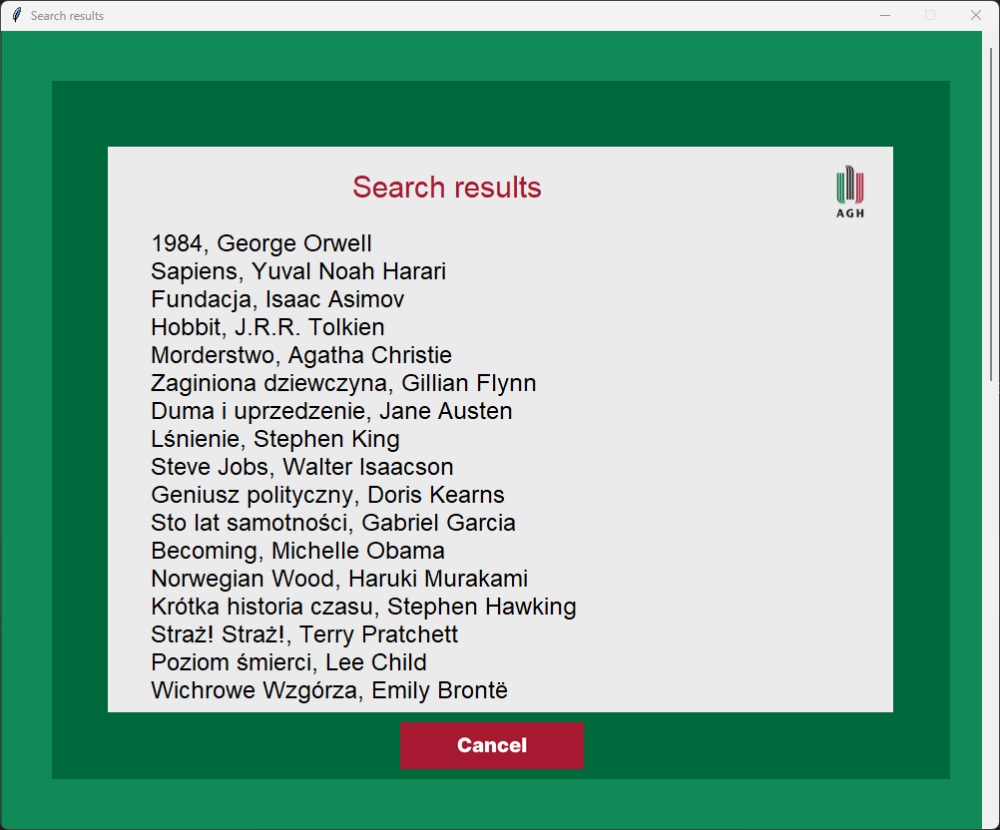
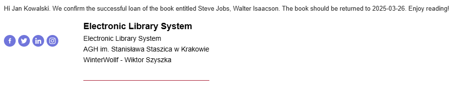
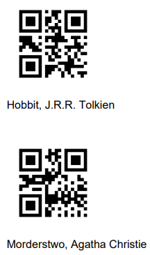
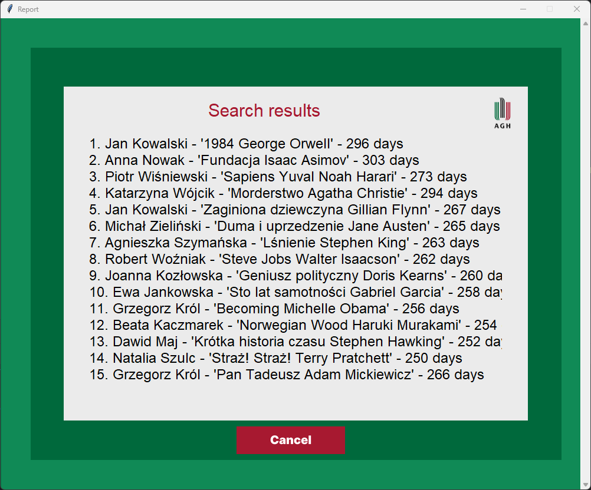
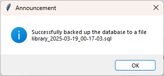

# Library Management System

## Description

Library Management System is a comprehensive application designed to manage library operations efficiently. It provides functionalities for book management, user management, book rentals, returns, generating reports and generating QR codes for books. The application is built using Python and Tkinter for the GUI, with MySQL as the database backend.

## Technologies Used

- **Python**
- **Tkinter**
- **MySQL**
- **tkcalendar**
- **pymysql**
- **pathlib**

## Features

### User Management
- **Add Reader**: Allows librarians to add new readers to the system.
- **Search User**: Provides functionality to search for users in the database.

### Book Management
- **Add Book**: Enables librarians to add new books to the library.
- **Search Book**: Allows searching for books in the library.
- **Book Overview**: Displays detailed information about a selected book.

### Rental Management
- **Add Rental**: Facilitates the process of renting out books to readers.
- **Return Book**: Manages the return of rented books.

### Reports and Backup
- **Generate QR Code**: Generates QR codes for books.
- **Generate Report**: Creates reports on various library metrics.
- **Backup**: Backs up the library database.

## Prerequisites

Before running the application, ensure you have the following installed:

- Python >3.11
- MySQL Server
- Required Python packages (listed in requirements.txt)

## Installation and Setup

1. **Clone the Repository**
   ```sh
   git clone https://github.com/WinterWollf/Library.git
   cd Library
   ```

2. **Install Required Packages**
   ```sh
   pip install -r requirements.txt
   ```

3. **Set Up the Database**
   - Create a MySQL database named `library`.
   - Execute the SQL commands in `src/Assets/Starting Commands (English).sql` to set up the necessary tables and initial data.

4. **Run the Application**
   ```sh
   python src/main.py
   ```

## Screenshots

Here are some screenshots showcasing the main features of the application:

### Login Page


### Dashboard


### Add Book


### Book Overview


### Book Search


### Mail


### QR Code


### Report


### Backup


## License

This project is licensed under the Creative Commons Attribution-NonCommercial 4.0 International (CC BY-NC 4.0) License - see the [LICENSE](LICENSE.txt) file for details.

## Contact

For any inquiries or feedback, please contact project author.

---