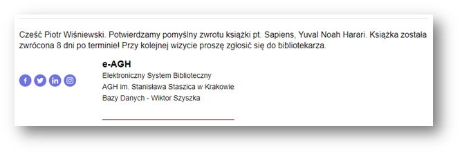

# Library System

A desktop application for managing a library created in Python using the Tkinter library.

## Features

- **Email Notifications**: The application allows sending confirmation emails for book loans and returns to users' email addresses.
- **QR Code Generation**: Books are marked with unique QR codes, enabling easy identification.
- **Statistics**: The application collects and displays various statistics related to book loans and returns.
- **Comprehensive Library System Functionality**: The application enables the addition and management of readers, along with many other features.
- **Database Integration**: The system is connected to an SQL database.
- **Backup Procedure**: The application includes a backup procedure to ensure data safety and integrity.

## Technologies

- Python 3.x
- Tkinter
- SQL

